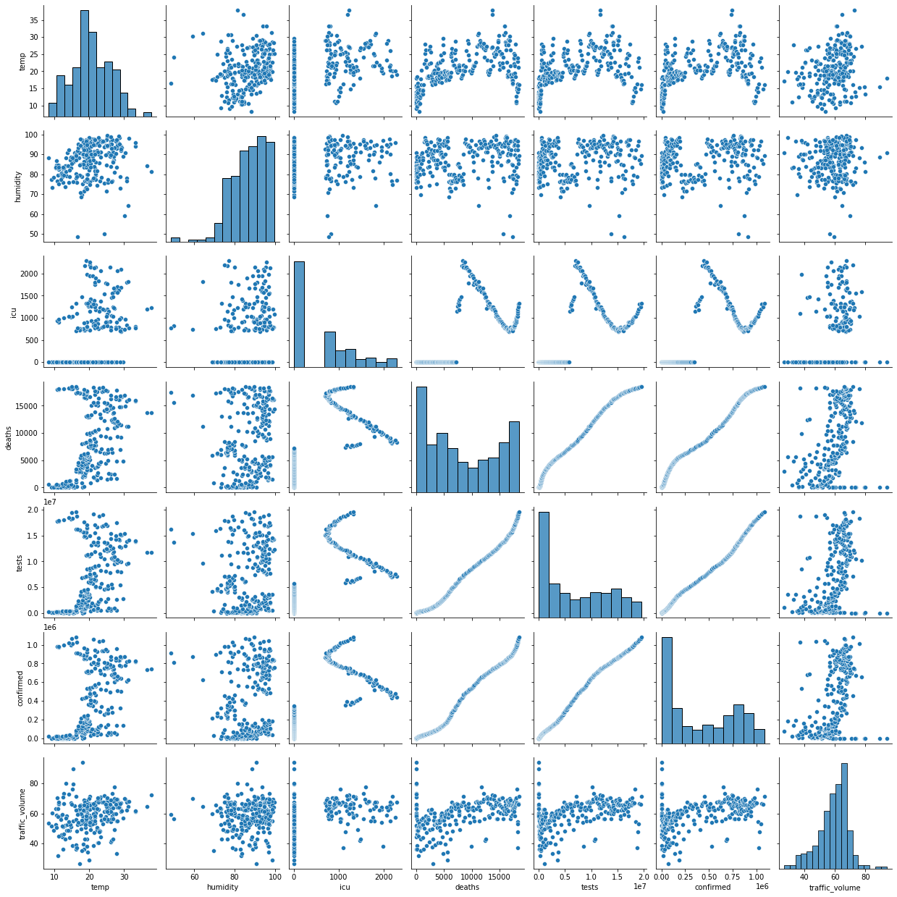
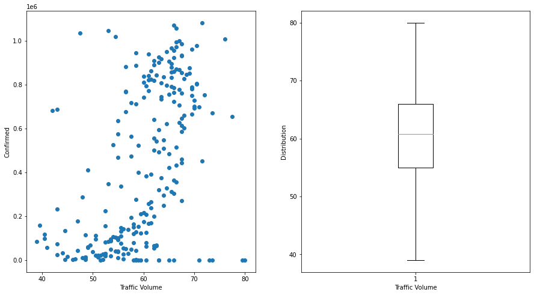

```python
import pandas as pd
import seaborn as sns
import matplotlib.pyplot as plt
```


```python
temp = pd.read_csv('temperature.csv')
humidity = pd.read_csv('humidity.csv')
covid = pd.read_csv('covid19.csv')
```


```python
data = pd.concat([temp[['date', 'da']], humidity['humidity'], covid[['icu', 'deaths', 'tests', 'confirmed']]], axis = 1)
```


```python
traffic = pd.read_csv('traffic.csv')
arr = []
for i,j in traffic.iterrows():
    arr.append(j[3])
res = []
for i in range(0,len(arr)-2,2):
    res.append((arr[i] + arr[i+1])/2)
df = pd.concat([data, pd.DataFrame(res)], axis = 1)
df.dropna(axis = 0, inplace = True)
df.columns = ["date", "temp", "humidity", "icu", "deaths", "tests", "confirmed", "traffic_volume"]
```


```python
df.to_csv('final_data.csv')    #save as csv
```


```python
df    #check the data
```


<div>
<style scoped>
    .dataframe tbody tr th:only-of-type {
        vertical-align: middle;
    }

    .dataframe tbody tr th {
        vertical-align: top;
    }
    
    .dataframe thead th {
        text-align: right;
    }
</style>
<table border="1" class="dataframe">
  <thead>
    <tr style="text-align: right;">
      <th></th>
      <th>date</th>
      <th>temp</th>
      <th>humidity</th>
      <th>icu</th>
      <th>deaths</th>
      <th>tests</th>
      <th>confirmed</th>
      <th>traffic_volume</th>
    </tr>
  </thead>
  <tbody>
    <tr>
      <th>0</th>
      <td>2020/3/4</td>
      <td>15.4</td>
      <td>88.462963</td>
      <td>0</td>
      <td>1</td>
      <td>325</td>
      <td>55</td>
      <td>89.5</td>
    </tr>
    <tr>
      <th>1</th>
      <td>2020/3/5</td>
      <td>18.0</td>
      <td>90.746269</td>
      <td>0</td>
      <td>1</td>
      <td>508</td>
      <td>67</td>
      <td>94.0</td>
    </tr>
    <tr>
      <th>2</th>
      <td>2020/3/6</td>
      <td>15.4</td>
      <td>85.944444</td>
      <td>0</td>
      <td>1</td>
      <td>715</td>
      <td>81</td>
      <td>79.5</td>
    </tr>
    <tr>
      <th>3</th>
      <td>2020/3/7</td>
      <td>12.6</td>
      <td>83.250000</td>
      <td>0</td>
      <td>1</td>
      <td>1206</td>
      <td>100</td>
      <td>73.5</td>
    </tr>
    <tr>
      <th>4</th>
      <td>2020/3/8</td>
      <td>12.4</td>
      <td>76.000000</td>
      <td>0</td>
      <td>1</td>
      <td>1382</td>
      <td>112</td>
      <td>71.0</td>
    </tr>
    <tr>
      <th>...</th>
      <td>...</td>
      <td>...</td>
      <td>...</td>
      <td>...</td>
      <td>...</td>
      <td>...</td>
      <td>...</td>
      <td>...</td>
    </tr>
    <tr>
      <th>256</th>
      <td>2020/11/15</td>
      <td>22.8</td>
      <td>94.229508</td>
      <td>1143</td>
      <td>18265</td>
      <td>18839535</td>
      <td>1035981</td>
      <td>47.5</td>
    </tr>
    <tr>
      <th>257</th>
      <td>2020/11/16</td>
      <td>23.9</td>
      <td>96.583333</td>
      <td>1199</td>
      <td>18304</td>
      <td>18993274</td>
      <td>1047360</td>
      <td>53.0</td>
    </tr>
    <tr>
      <th>258</th>
      <td>2020/11/17</td>
      <td>21.1</td>
      <td>87.000000</td>
      <td>1318</td>
      <td>18360</td>
      <td>19191038</td>
      <td>1058096</td>
      <td>66.5</td>
    </tr>
    <tr>
      <th>259</th>
      <td>2020/11/18</td>
      <td>14.9</td>
      <td>85.205882</td>
      <td>1252</td>
      <td>18467</td>
      <td>19424942</td>
      <td>1069517</td>
      <td>66.0</td>
    </tr>
    <tr>
      <th>260</th>
      <td>2020/11/19</td>
      <td>16.1</td>
      <td>89.481481</td>
      <td>1332</td>
      <td>18555</td>
      <td>19649202</td>
      <td>1082674</td>
      <td>71.5</td>
    </tr>
  </tbody>
</table>
<p>261 rows × 8 columns</p>
</div>


```python
plt.subplot(2,2,1)
plt.boxplot(df["temp"])
plt.xlabel("Temperature")
plt.subplot(2,2,2)
plt.boxplot(df["humidity"])
plt.xlabel("Humidity")
plt.subplot(2,2,3)
plt.boxplot(df["icu"])
plt.xlabel("ICU")
plt.subplot(2,2,4)
plt.boxplot(df["traffic_volume"])
plt.xlabel("Traffic Volume")
```


    Text(0.5, 0, 'Traffic Volume')


​    

​    


```python
sns.pairplot(df)
```


    <seaborn.axisgrid.PairGrid at 0x7fa648820a30>


​    

​    


```python
df.drop("tests", axis = 1, inplace = True)    #similary data
df.drop("deaths",axis = 1, inplace = True) 
```


```python
df = df[df["temp"] <= 35]    #delete edge value
df = df[df["traffic_volume"] >= 39]
df = df[df["traffic_volume"] <= 80]
df = df[df["humidity"] >63]
```


```python
df
```


<div>
<style scoped>
    .dataframe tbody tr th:only-of-type {
        vertical-align: middle;
    }

    .dataframe tbody tr th {
        vertical-align: top;
    }
    
    .dataframe thead th {
        text-align: right;
    }
</style>
<table border="1" class="dataframe">
  <thead>
    <tr style="text-align: right;">
      <th></th>
      <th>date</th>
      <th>temp</th>
      <th>humidity</th>
      <th>icu</th>
      <th>confirmed</th>
      <th>traffic_volume</th>
    </tr>
  </thead>
  <tbody>
    <tr>
      <th>2</th>
      <td>2020/3/6</td>
      <td>15.4</td>
      <td>85.944444</td>
      <td>0</td>
      <td>81</td>
      <td>79.5</td>
    </tr>
    <tr>
      <th>3</th>
      <td>2020/3/7</td>
      <td>12.6</td>
      <td>83.250000</td>
      <td>0</td>
      <td>100</td>
      <td>73.5</td>
    </tr>
    <tr>
      <th>4</th>
      <td>2020/3/8</td>
      <td>12.4</td>
      <td>76.000000</td>
      <td>0</td>
      <td>112</td>
      <td>71.0</td>
    </tr>
    <tr>
      <th>5</th>
      <td>2020/3/9</td>
      <td>14.0</td>
      <td>75.956522</td>
      <td>0</td>
      <td>172</td>
      <td>73.0</td>
    </tr>
    <tr>
      <th>6</th>
      <td>2020/3/10</td>
      <td>13.3</td>
      <td>81.391304</td>
      <td>0</td>
      <td>179</td>
      <td>80.0</td>
    </tr>
    <tr>
      <th>...</th>
      <td>...</td>
      <td>...</td>
      <td>...</td>
      <td>...</td>
      <td>...</td>
      <td>...</td>
    </tr>
    <tr>
      <th>256</th>
      <td>2020/11/15</td>
      <td>22.8</td>
      <td>94.229508</td>
      <td>1143</td>
      <td>1035981</td>
      <td>47.5</td>
    </tr>
    <tr>
      <th>257</th>
      <td>2020/11/16</td>
      <td>23.9</td>
      <td>96.583333</td>
      <td>1199</td>
      <td>1047360</td>
      <td>53.0</td>
    </tr>
    <tr>
      <th>258</th>
      <td>2020/11/17</td>
      <td>21.1</td>
      <td>87.000000</td>
      <td>1318</td>
      <td>1058096</td>
      <td>66.5</td>
    </tr>
    <tr>
      <th>259</th>
      <td>2020/11/18</td>
      <td>14.9</td>
      <td>85.205882</td>
      <td>1252</td>
      <td>1069517</td>
      <td>66.0</td>
    </tr>
    <tr>
      <th>260</th>
      <td>2020/11/19</td>
      <td>16.1</td>
      <td>89.481481</td>
      <td>1332</td>
      <td>1082674</td>
      <td>71.5</td>
    </tr>
  </tbody>
</table>
<p>240 rows × 6 columns</p>
</div>


```python
plt.figure(figsize = (16,8))    #show the relations between temprature and confirmed people
plt.subplot(1,2,1)
plt.scatter(df["temp"], df["confirmed"])
plt.xlabel("Temprature")
plt.ylabel("Confirmed")
plt.subplot(1,2,2)
plt.boxplot(df["temp"])
plt.xlabel("Temperature")
plt.ylabel("Distribution")
sns.jointplot(df["temp"], df["confirmed"], kind = "hex")
```


    <seaborn.axisgrid.JointGrid at 0x7fa638ce72b0>


​    

​    


    


```python
plt.figure(figsize = (16,8))    #show the relations between humidity and confirmed people
plt.subplot(1,2,1)
plt.scatter(df["humidity"], df["confirmed"])
plt.xlabel("Humidity")
plt.ylabel("Confirmed")
plt.subplot(1,2,2)
plt.boxplot(df["humidity"])
plt.xlabel("Humidity")
plt.ylabel("Distribution")
sns.jointplot(df["humidity"], df["confirmed"], kind = "hex")
```

    /opt/anaconda3/lib/python3.8/site-packages/seaborn/_decorators.py:36: FutureWarning: Pass the following variables as keyword args: x, y. From version 0.12, the only valid positional argument will be `data`, and passing other arguments without an explicit keyword will result in an error or misinterpretation.
      warnings.warn(


    <seaborn.axisgrid.JointGrid at 0x7fa609ab4730>


​    

​    


    


```python
plt.figure(figsize = (15,8))    #show the relations between icu and confirmed people
plt.subplot(1,2,1)
plt.scatter(df["icu"], df["confirmed"])
plt.xlabel("ICU")
plt.ylabel("Confirmed")
plt.subplot(1,2,2)
plt.boxplot(df["icu"])
plt.xlabel("ICU")
plt.ylabel("Distribution")
sns.jointplot(df["icu"], df["confirmed"], kind = "hex")
```


    <seaborn.axisgrid.JointGrid at 0x7fa638e15e80>


​    

​    


    


```python
plt.figure(figsize = (15,8))    #show the relations between traffic volume and confirmed people
plt.subplot(1,2,1)
plt.scatter(df["traffic_volume"], df["confirmed"])
plt.xlabel("Traffic Volume")
plt.ylabel("Confirmed")
plt.subplot(1,2,2)
plt.boxplot(df["traffic_volume"])
plt.xlabel("Traffic Volume")
plt.ylabel("Distribution")
sns.jointplot(df["traffic_volume"], df["confirmed"], kind = "hex")
```


    <seaborn.axisgrid.JointGrid at 0x7fa638e83d90>


​    

​    


    


```python
sns.heatmap(df.drop("date", axis = 1).drop("confirmed", axis = 1))
```


    <AxesSubplot:>


​    

​    


```python
from sklearn.linear_model import LinearRegression    #import machine learning packages
from sklearn.model_selection import train_test_split
from xgboost.sklearn import XGBRegressor
from sklearn.svm import SVR
from sklearn.neural_network import MLPRegressor
from sklearn.linear_model import LogisticRegression
```


```python
X, y = df[["temp", 'humidity', "icu", "traffic_volume" ]], df["confirmed"]
X_train, X_test, y_train, y_test = train_test_split(X, y, test_size = 0.33, random_state = 17)#split dataset
```


```python
lm = LinearRegression()    #Linear Regression
lm.fit(X_train, y_train)
res_LR = lm.predict(X_test)
```


```python
regressor = XGBRegressor()  #XGB Regressor
regressor.fit(X_train, y_train)
res_XGB = regressor.predict(X_test)
```


```python
svr =SVR(C = 0.5)    #Support Vector Machine
svr.fit(X_train, y_train)
res_SVR = svr.predict(X_test)
```


```python
mlp = MLPRegressor(hidden_layer_sizes=(100,50), activation='relu',solver='adam',alpha=0.01,max_iter=50000)    #MLP Regressor
mlp.fit(X_train,y_train)
res_MLP = mlp.predict(X_test)
```


```python
logistic = LogisticRegression(C = 1, max_iter = 1e7)
logistic.fit(X_train, y_train)
res_LOG = logistic.predict(X_test)
```


```python
from sklearn import metrics    #calculate the mean squre error of the models
def calMSE(predictList, testList, name):
    print("The MSE of the regression model " + name + " is : %.4f" % (metrics.mean_squared_error(testList, predictList)))
    print("The R^2 of the regression model " + name + " is : %.4f" % (metrics.r2_score(testList,predictList)))
```


```python
calMSE(res_LR, y_test, "Linear Regressor")    #show the result
calMSE(res_SVR, y_test, "SVR Regressor")
calMSE(res_LOG, y_test, "Logistic Regressor")
calMSE(res_XGB, y_test, "XGB Regressor")
calMSE(res_MLP, y_test, "MLP Regressor")
```

    The MSE of the regression model Linear Regressor is : 59115793490.1905
    The R^2 of the regression model Linear Regressor is : 0.5361
    The MSE of the regression model SVR Regressor is : 143231449030.1893
    The R^2 of the regression model SVR Regressor is : -0.1239
    The MSE of the regression model Logistic Regressor is : 17432926185.7125
    The R^2 of the regression model Logistic Regressor is : 0.8632
    The MSE of the regression model XGB Regressor is : 13252068369.4420
    The R^2 of the regression model XGB Regressor is : 0.8960
    The MSE of the regression model MLP Regressor is : 12611696256.2392
    The R^2 of the regression model MLP Regressor is : 0.9010

